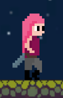
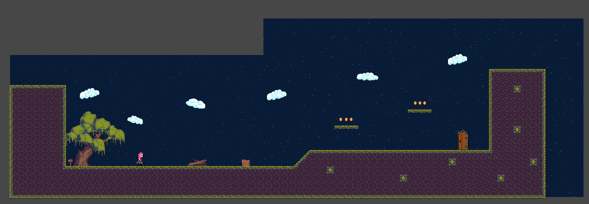

# Pink Girl Adventures

&nbsp;

## Index

 - [Description](#Description)
 
 - [Characters](#Characters)
 
 - [Scenarios](#Scenarios)

 - [Instructions](#Instructions) 
 
 - [Download](#Download) 

&nbsp;

***

&nbsp;

## **Description**

&nbsp;

This project is a platform game, in which you will have to overcome a series of obstacles and enemies until you reach the final boss, where you will have to fight against him.

In the game there will also be coins to collect and objects that will allow you to perform certain actions.

&nbsp;

***It was developed as a college project in almost 1 month***

&nbsp;

***

&nbsp;

## **Characters**

&nbsp;

The main character is the **Pink Girl**, which is the one you control.

  

&nbsp;

There are 3 enemies types: **Goblin**, **Slime** y **Mushroom**.

Both of them make a pre-established route from one point on the map to another and if the main character collides with them, it will be damage.

  

&nbsp;

Finally, there is a final boss: **The Minotaur**.

This enemy will follow the main character until he is close enough to hit him.

After each hit, he will have to recover energy, so it will take a few seconds to follow the enemy again.

  

&nbsp;

***

&nbsp;

## **Scenarios**

&nbsp;

 - **Menu Screen**:
  
    It is displayed when you start the game.
    
    Allows you to start the game, access the game options or exit the game.

    

    
&nbsp;

 - **Options Screen**:
  
    Allows you to enable or disable the audio for all game and return to the start menu.
    
    

    
&nbsp;

 - **Initial Game Screen**:
  
    It is a reduced version of the main map.
    
    It has some objects and allows the user to get used to the controls.
    
    

    
&nbsp;

 - **Game Screen**:
  
    It is the main map of the game, where most of the content is located.
        
    

    

    
&nbsp;

 - **Boss Screen**:
  
    It is the screen where you fight the final boss.
    
    Defeating him gives you the option to return to the start menu.
    
    

    
&nbsp;

&nbsp;

***

&nbsp;

## **Instructions**

&nbsp;

 - **Controls**:
  
    - **W** or **Space** → Jump

    - **A** or **Left Arrow** → Move Left

    - **D** or **Right Arrow** → Move Right

    - **E** → Interact

    - **1** or **Left Mouse Click** → Attack 1

    - **2** or **Right Mouse Click** → Attack 2

    - **3** or **Middle Mouse Click** → Attack 3 

&nbsp;

The character has **3 hearts of life**. If he loses them, he dies and the game will have to be restarted.

Around the map there will be **coins** that you can collect to increase the coin counter. There is also a **heart of life** hidden on the map, which will **restore you life**.

To achive the **final boss screen**, you will have to **collect a key** that will be hidden by the map. In addition, if you **find a rune** this will provide you **extra life** for the final battle.

&nbsp;

***

&nbsp;

## **Download**

&nbsp;

You can download the game in the following link → [Download here](https://downgit.github.io/#/home?url=https://github.com/GabyDev12/Pink_Girl_Adventures/tree/master/Builds/Windows)

*Unzip the file and execute the .exe file*

&nbsp;

Or you can go to its web page → [https://gabydev12.itch.io/pink-girl-adventures](https://gabydev12.itch.io/pink-girl-adventures)

